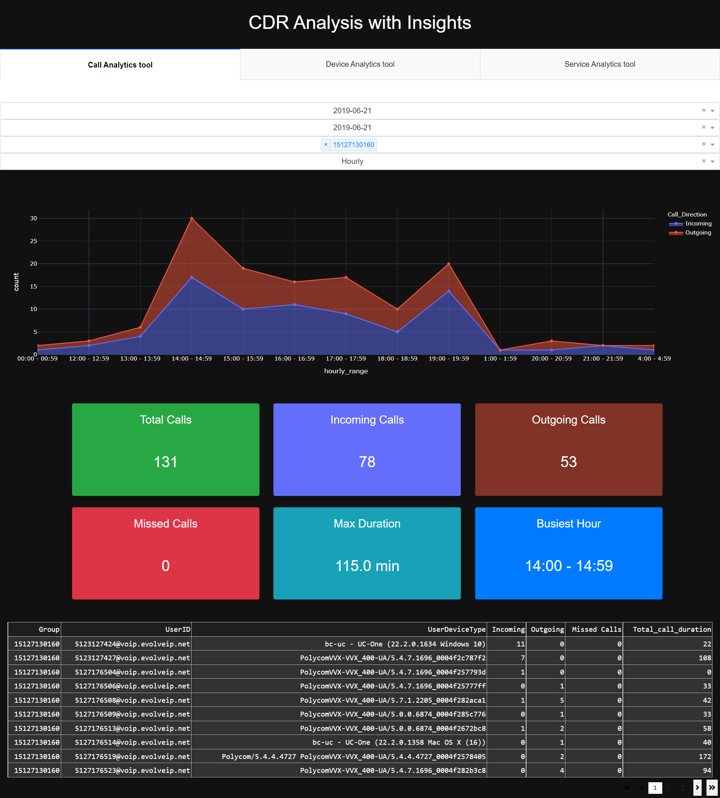
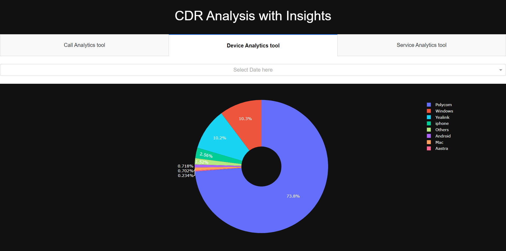
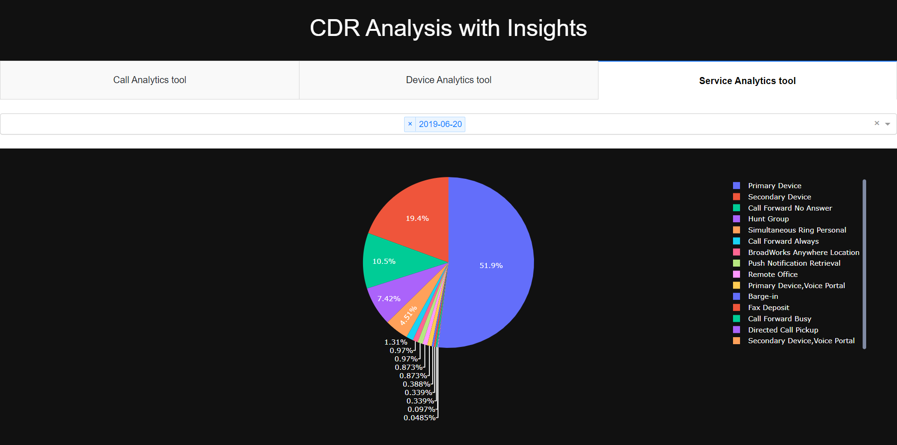

# CDR Data Analysis

CDR Data Analysis provide dashboard using raw cdr data.


## Files

raw_cdr_data.csv: This is the csv which client has given to us from which we have create seprate csv files for each section which are as follow:

    1) Call_data.csv : This csv file contain the data realted to call

    2) Device_data.csv : This csv file contain the data realted to devices

    3) Service_data.csv : This csv file contain the data realted to services

app.py : This script helps to clean the raw_cdr_data.csv

create_csv.py : This script helps to create other csv such as Call_data.csv, Device_data.csv and Service_data.csv

dashboard.py : This script create a dashboard using Call_data.csv, Device_data.csv and services_data.csv


## Screenshots

### Call Analysis tool


### Device Analysis Tool


### Service Analysis Tool


## Run Locally

Clone the project

```bash
  git clone https://github.com/vivekvedant/CDR-Analysis.git
```

Go to the project directory

```bash
  cd CDR-Analysis
```

Install dependencies

```bash
  pip install -r requirements.txt
```

Start the server

```bash
  python dashboard.py
```

  
